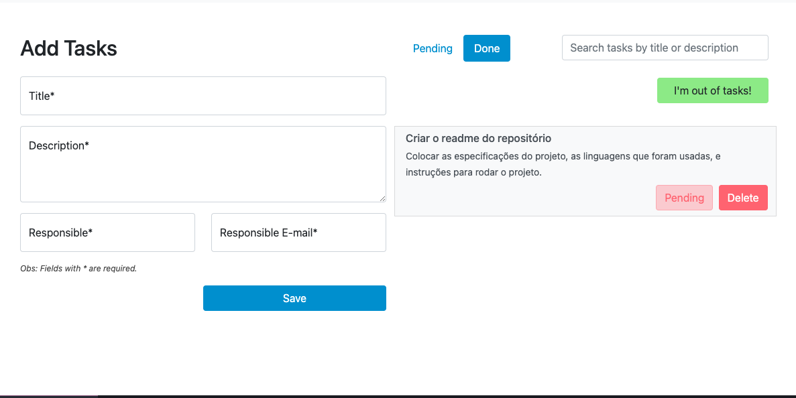

<h1 align="center">
  TodoList Angular
</h1>

# Índice

- [Sobre](#sobre)
- [Tecnologias Utilizadas](#tecnologias-utilizadas)
- [Como Usar](#como-usar)

<a id="sobre"></a>

## :bookmark: Sobre

O <strong>TodoList Angular</strong> é uma aplicação Web com o foco em treinar e aperfeiçoar conceitos e técnicas pessoais. 

<a id="tecnologias-utilizadas"></a>

## :rocket: Tecnologias Utilizadas

Durante o desenvolvimento desse projeto utilizamos as seguintes tecnologias.

- Angular
- Node.js

## :computer: Web

Abaixo está um exemplo da home da aplicação

<h1 align="center">
    
</h1>

<a id="como-usar"></a>

## :question: Como usar

- #### Para conseguir rodar a aplicação é necessário alguns **pré-requisitos:**

  - É **necessário** possuir o **Angular CLI** instalado na máquina
  - É **necessário** possuir o **Node.js** instalado na máquina
  - Também, é **preciso** ter um gerenciador de pacotes seja o **NPM** ou **Yarn**.
  - Banco de dados, de preferência usar o **MySql**, porém pode ser usado um de sua preferência, porém se escolher outro, é preciso mudar algumas coisas, como a configuração de banco em `api/src/config/dbConfig.js`

1. Faça um clone :

```sh
  $ git clone https://github.com/Arthurferrera/todolist-angular.git
```

2. Para executar a Aplicação execute os seguintes comandos:

```sh
  # Primeiro pegue o arquivo dump em dump/, crie um banco de dados na sua conexão localhost e importe esse dump
  
  # Acesse a pasta da api do projeto
  $ cd api
  # Instale as dependências
  $ npm install
  # Inicie o projeto
  $ npm start
  
  # Acesse a pasta do projeto web
  $ cd site
  # Instale as dependências
  $ npm install
  # Inicie o projeto
  $ ng serve -o
```


<h5 align="center">
    Developed by <a href="https://www.linkedin.com/in/arthurferreira99/" target="_blank">Arthur Ferreira</a>
</h5>
